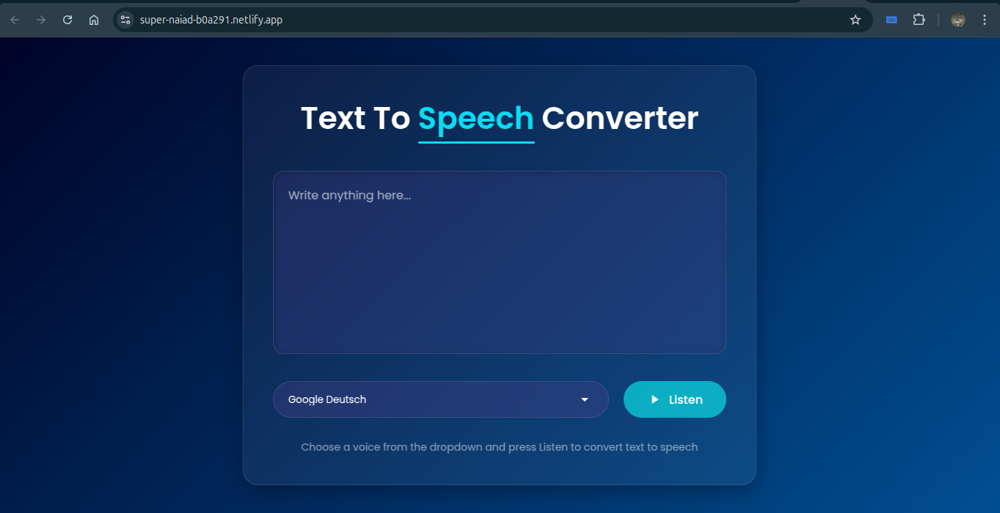

# Text-to-Speech Converter

A simple web-based Text-to-Speech (TTS) Converter app built using HTML, CSS, and JavaScript. This app allows users to enter text and convert it into speech using the Web Speech API.

## Features

- User-friendly interface
- Converts text to speech in real-time
- Supports different voices and languages (depending on browser support)
- Works on modern web browsers

## Technologies Used

- **HTML**: Structure of the web page
- **CSS**: Styling for a responsive and attractive UI
- **JavaScript**: Core logic using the Web Speech API

## How to Use

1. Open the `index.html` file in your browser.
2. Type or paste text into the input box.
3. Select a voice and adjust settings (optional).
4. Click the "Listen" button to hear the text.

## Installation

1. Clone this repository:
   ```sh
   git clone https://github.com/R-Kri/Text-To-Speech-Converter.git
   ```
2. Navigate to the project folder:
   ```sh
   cd Text-To-Speech-Converter
   ```
3. Open `index.html` in a web browser.

## Website is Live
Check out the live version of the app here: [Live Demo](https://super-naiad-b0a291.netlify.app/)

## Browser Compatibility
This app works best on modern browsers that support the Web Speech API, such as:

- Google Chrome
- Mozilla Firefox
- Microsoft Edge

## License
This project is open-source and available under the [MIT License](LICENSE).

## Contributing
Contributions are welcome! If you'd like to improve this project, feel free to fork the repository and submit a pull request.

## Author
Developed by **R-Kri**

---
### Screenshot

